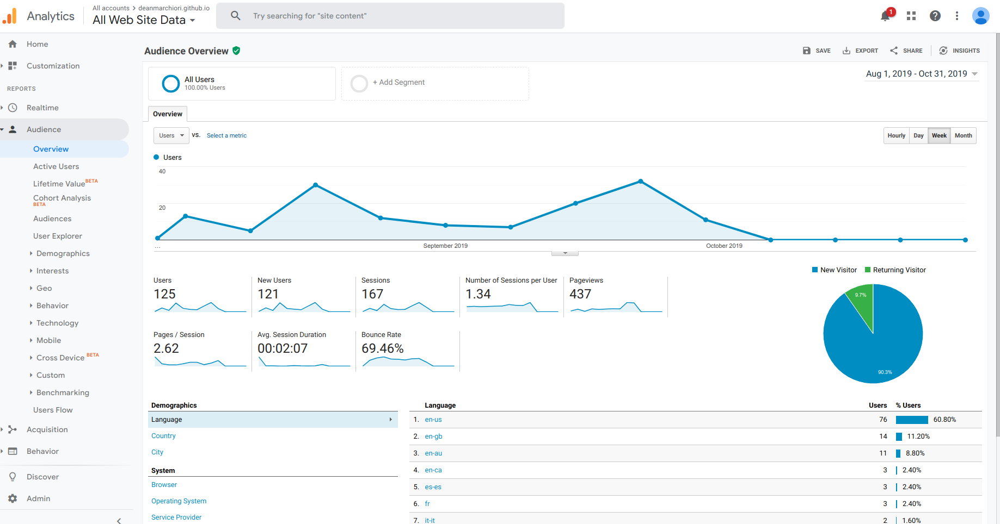
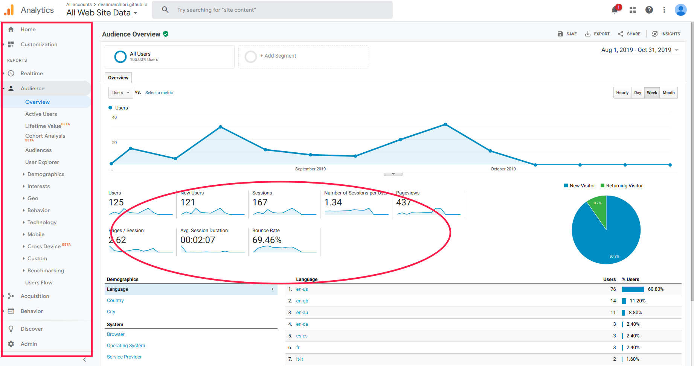
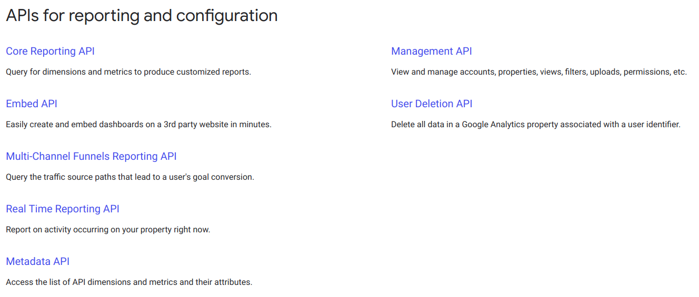
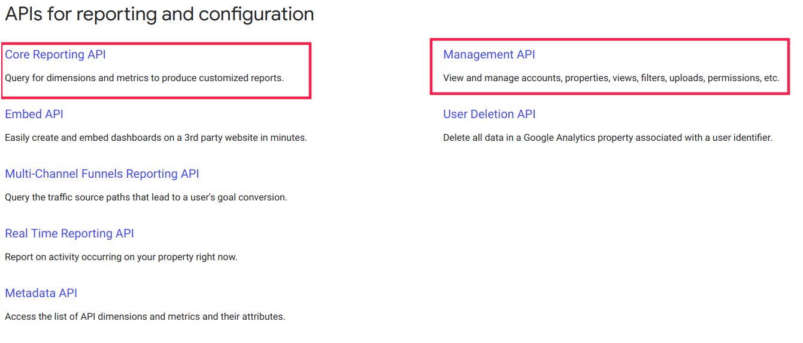

```{css eval=FALSE, include=FALSE}
pre {
  max-width: 100%;
  overflow-x: scroll;
}
.left-code {
  color: #777;
  width: 38%;
  height: 92%;
  float: left;
  font-size: 70% 
}
.right-plot {
  width: 60%;
  float: right;
  padding-left: 1%;
}
.remark-code { font-family: 'Source Code Pro', 'Lucida Console', Monaco, monospace;
                                    font-size: 70%;
}
.inverse {
  background-color: #132734;
  color: #d6d6d6;
  text-shadow: 0 0 20px #333;
}
.title-slide {
  background-color: #132734;
  color: #d6d6d6;
  text-shadow: 0 0 20px #333;
  class: inverse, center, middle;
  background-image: url('img/logo.png');  
  background-position: 5% 98%;  
  background-size: 150px ;
}


```

class: inverse, center, middle

# Dean Marchiori  
deanmarchiori.github.io  

---

# What is Google Analytics?   

* web analytics service  
* free (to a point)  
* awesome for basic reports    

```{r echo=FALSE}

```


---

# What is it not?   
* advanced analytics / modelling platform  
* extensible   
* simple  

```{r echo=FALSE}

```

---

# How GA thinks about data   

## Dimensions  

--

The attributes of your data  

--

## Metrics  

--

The quantitative measurements  

---

# example  

page | sessions 
--|---
/ | 526  
/aboutme | 251  
/contact | 230  

--

`page` : is the dimension  
`sessions`: is the metric  

---

# time series example    


|date       | sessions|
|:----------|--------:|
|2019-07-01 |        1|
|2019-07-02 |       17|
|2019-07-03 |        2|
|2019-07-04 |        4|
|2019-07-05 |        0|
|2019-07-06 |        0|
|2019-07-07 |        1|
|2019-07-08 |        1|
|2019-07-09 |        3|
|2019-07-10 |        2|
|2019-07-11 |        0|
|2019-07-12 |        3|


---

# Going nuts

|date       |browser           |browserversion   | sessions| bouncerate|
|:----------|:-----------------|:----------------|--------:|----------:|
|2019-07-01 |Chrome            |75.0.3770.100    |        1|    0.00000|
|2019-07-02 |'Mozilla          |5.0              |       16|  100.00000|
|2019-07-02 |Chrome            |72.0.3626.109    |        1|    0.00000|
|2019-07-03 |Chrome            |72.0.3626.109    |        1|    0.00000|
|2019-07-03 |Chrome            |75.0.3770.100    |        1|    0.00000|
|2019-07-04 |Chrome            |75.0.3770.100    |        3|   33.33333|
|2019-07-04 |Safari            |13.0             |        1|  100.00000|
|2019-07-07 |Opera             |52.4.2517.140781 |        1|  100.00000|
|2019-07-08 |Chrome            |75.0.3770.100    |        1|  100.00000|
|2019-07-09 |Chrome            |72.0.3626.109    |        1|    0.00000|
|2019-07-09 |Chrome            |73.0.3683.88     |        1|  100.00000|
|2019-07-09 |Chrome            |75.0.3770.100    |        1|  100.00000|
|2019-07-10 |Chrome            |75.0.3770.100    |        1|    0.00000|
|2019-07-10 |Firefox           |67.0             |        1|  100.00000|
|2019-07-12 |Chrome            |75.0.3770.100    |        1|  100.00000|
|2019-07-12 |Chrome            |75.0.3770.101    |        1|  100.00000|

---
class: inverse, center, middle

# Yeah, but how do I get it out?  

---

# API    

```{r echo=FALSE}

```

source: https://developers.google.com/analytics  

---

# API    

```{r echo=FALSE}

```

source: https://developers.google.com/analytics  


---

# Query Explorer

https://ga-dev-tools.appspot.com/query-explorer/

```{r echo=FALSE}
knitr::include_graphics('img/queryexplorer.png', dpi = 200)
```

---

# BigQuery   

* Google cloud based data warehouse solution  
* Users of Analytics 360 only  
* Get a full export daily of all sessions and hits  
* query in a SQL like syntax


---
class: inverse, center, middle

# Yeah, but how do I get it out???  


---

# Packages  

---


