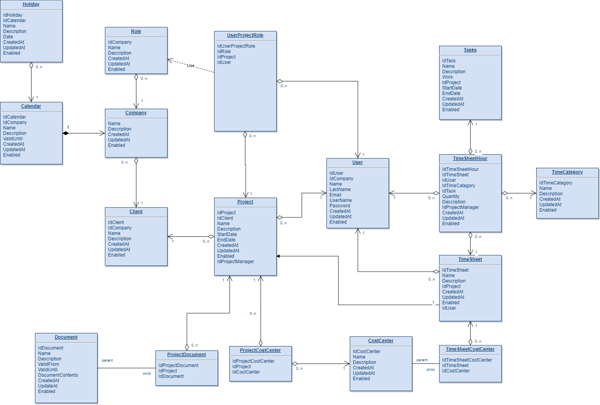

```{css echo = FALSE}
.inverse {
  background-color: #0B4A72;
  color: #0B4A72;
  text-shadow: 0 0 20px #333;
}
.title-slide {
  background-color: #0B4A72;
  color: #0B4A72;
  text-shadow: 0 0 20px #333;
  class: inverse, center, middle;
  background-position: 5% 98%;  
  background-size: 150px ;
}
h1 {
  color: #1D70B8;
}

```


---
class:  center, middle  

```{r echo=FALSE}
knitr::include_graphics('img/dean.jpg', dpi = 600)
```

---
class:  center, middle  

```{r echo=FALSE}
knitr::include_graphics('img/20191104_102759.jpg', dpi = 600)
```

---
class:  center, middle  

```{r echo=FALSE}
knitr::include_graphics('img/20191104_103641.jpg', dpi = 600)
```

---
# why pearls and pitfalls?

>  Clinical pearls are " small bits of free standing, clinically relevant information based on experience or observation."   

<br>  

*Lorin, Martin & Palazzi, Debra & Turner, Teri & Ward, Mark. (2008). What is a clinical pearl and what is its role in medical education?. Medical teacher. 30. 870-4. 10.1080/01421590802144286.* 

---

# industrial data analysis  

--

## 1. Productive   

--

## 2. Efficient  

--

## 3. Effective  

--

> # Profitable  


---
class: inverse, center, middle  

# perfect is the enemy of good

---
class: inverse, center, middle    

# everything you need to know

---
class: inverse, center, middle    

# ~~Everything you need to know~~  
# The least you need to know


---
# relies on..

## 1. Analyst being compentent  
## 2. Tools being well designed    

---


# what is Google Analytics?   

* web analytics service  
* free (to a point)  
* awesome for basic reports    

```{r echo=FALSE}
knitr::include_graphics('img/ga.png')
```


---

# what is it not?   
* advanced analytics / modelling platform  
* extensible   
* simple  

```{r echo=FALSE}
knitr::include_graphics('img/ga2.png')
```


---

# GA sees data as *dimensions* and *metrics*

--

## dimensions  

The attributes of your data  

--

## Metrics  

The quantitative measurements  

---

# example  

page | sessions 
--|---
/ | 526  
/aboutme | 251  
/contact | 230  

--

`page` : is the dimension  
`sessions`: is the metric  

---

# time series example    


|date       | sessions|
|:----------|--------:|
|2019-07-01 |        1|
|2019-07-02 |       17|
|2019-07-03 |        2|
|2019-07-04 |        4|
|2019-07-05 |        0|
|2019-07-06 |        0|
|2019-07-07 |        1|
|2019-07-08 |        1|
|2019-07-09 |        3|
|2019-07-10 |        2|
|2019-07-11 |        0|
|2019-07-12 |        3|


---

# going nuts

|date       |browser           |browserversion   | sessions| bouncerate|
|:----------|:-----------------|:----------------|--------:|----------:|
|2019-07-01 |Chrome            |75.0.3770.100    |        1|    0.00000|
|2019-07-02 |'Mozilla          |5.0              |       16|  100.00000|
|2019-07-02 |Chrome            |72.0.3626.109    |        1|    0.00000|
|2019-07-03 |Chrome            |72.0.3626.109    |        1|    0.00000|
|2019-07-03 |Chrome            |75.0.3770.100    |        1|    0.00000|
|2019-07-04 |Chrome            |75.0.3770.100    |        3|   33.33333|
|2019-07-04 |Safari            |13.0             |        1|  100.00000|
|2019-07-07 |Opera             |52.4.2517.140781 |        1|  100.00000|
|2019-07-08 |Chrome            |75.0.3770.100    |        1|  100.00000|
|2019-07-09 |Chrome            |72.0.3626.109    |        1|    0.00000|
|2019-07-09 |Chrome            |73.0.3683.88     |        1|  100.00000|
|2019-07-09 |Chrome            |75.0.3770.100    |        1|  100.00000|
|2019-07-10 |Chrome            |75.0.3770.100    |        1|    0.00000|
|2019-07-10 |Firefox           |67.0             |        1|  100.00000|
|2019-07-12 |Chrome            |75.0.3770.100    |        1|  100.00000|
|2019-07-12 |Chrome            |75.0.3770.101    |        1|  100.00000|

---
class: inverse, center, middle

# Yeah, but how do I get it out?  

---

# API    

```{r echo=FALSE}

```

source: https://developers.google.com/analytics  

---

# don't forget the *Management API*   

```{r echo=FALSE}
knitr::include_graphics('img/api2.png')
```

source: https://developers.google.com/analytics  


---
class: inverse, center, middle

# Yeah, but how do I get it out???  


---
background-image: url(img/gar.png)
background-position: 90% 7%
background-size: 100px
  
  
# use `googleAnalyticsR`    

Maintained by Mark Edmondson  

- Well maintained  
- Well documented  
- Loads of useful functions  

--

Notable Mentions:  
* [rga](https://cran.r-project.org/web/packages/RGA/index.html)  
* [RGoogleAnalytics](https://cran.r-project.org/web/packages/RGoogleAnalytics/index.html)  
* [ganalytics](https://cran.rstudio.com/web/packages/ganalytics/index.html)  
* [GAR](https://cran.r-project.org/web/packages/GAR/index.html)  


---

# time series example    


```{r eval=FALSE, include=TRUE}
library(googleAnalyticsR)
library(tsibble)
library(fable)
library(tidyverse)

ga_demo <- google_analytics(viewId = 1234567, 
                            date_range = c('2019-07-01', '2019-08-31'), 
                            dimensions = c("date"),
                            metrics = "sessions", 
                            max = -1) %>% 
  as_tsibble()

ga_demo %>%  
  model(ets = ETS(sessions)) %>% 
  forecast(h = 20) %>% 
  autoplot(ga_demo)

```  

---

```{r echo=FALSE, fig.width=12, message=FALSE, warning=FALSE}
library(googleAnalyticsR)
library(tsibble)
library(fable)
library(tidyverse)

ga_demo <- tibble::tribble(
                                                   ~date, ~sessions,
                                                20190701,      2742,
                                                20190702,      2574,
                                                20190703,      2488,
                                                20190704,      1720,
                                                20190705,      1713,
                                                20190706,      1490,
                                                20190707,      1480,
                                                20190708,      2685,
                                                20190709,      2897,
                                                20190710,      2714,
                                                20190711,      2449,
                                                20190712,      2171,
                                                20190713,      1486,
                                                20190714,      1434,
                                                20190715,      2616,
                                                20190716,      2600,
                                                20190717,      2399,
                                                20190718,      2484,
                                                20190719,      2246,
                                                20190720,      1391,
                                                20190721,      1492,
                                                20190722,      2356,
                                                20190723,      2292,
                                                20190724,      2451,
                                                20190725,      2282,
                                                20190726,      2171,
                                                20190727,      1403,
                                                20190728,      1432,
                                                20190729,      2350,
                                                20190730,      2454,
                                                20190731,      2271,
                                                20190801,      2228,
                                                20190802,      2081,
                                                20190803,      1354,
                                                20190804,      1583,
                                                20190805,      2424,
                                                20190806,      3255,
                                                20190807,      3353,
                                                20190808,      2431,
                                                20190809,      2425,
                                                20190810,      1640,
                                                20190811,      1431,
                                                20190812,      2387,
                                                20190813,      2437,
                                                20190814,      2184,
                                                20190815,      2112,
                                                20190816,      2083,
                                                20190817,      1423,
                                                20190818,      1536,
                                                20190819,      2805,
                                                20190820,      3313,
                                                20190821,      2480,
                                                20190822,      2491,
                                                20190823,      2292,
                                                20190824,      1669,
                                                20190825,      1539,
                                                20190826,      2413,
                                                20190827,      2634,
                                                20190828,      2375,
                                                20190829,      2435,
                                                20190830,      2034,
                                                20190831,      1473
                                                ) %>% 
  mutate(date = lubridate::ymd(date)) %>% 
    as_tsibble() 

ga_demo %>%
  model(ets = ETS(sessions,)) %>% 
  forecast(h = 30) %>% 
  autoplot(ga_demo) 

```


---

# carefully check the number of rows   

* Defaults to 1000
* Up to 100k rows per API call  
* Batches of up to 5 can be processed, but complicated requests may result in a `500` error. (See `slow_fetch = TRUE`)

--

```{r eval=FALSE, include=TRUE}
library(googleAnalyticsR)

my_ga <- google_analytics(viewId = 1234567, 
                          date_range = c('2019-01-01', '2019-02-01'), 
                          dimensions = "date",
                          metrics = "sessions", 
                          max = -1) #<<

```

*`max`:	 Maximum number of rows to fetch. Defaults at 1000. Use -1 to fetch all results. Ignored when `anti_sample=TRUE`.*   


---
 
# beware of sampling if accuracy really matters    

* To speed up processing, Google will 'sample' larger reports based on just a percentage of total sessions.
* You can control sampling with `samplingLevel = c("DEFAULT", "SMALL", "LARGE")`  
* Or turn it off - but this uses more API calls 

--

```{r eval=FALSE, include=TRUE}
library(googleAnalyticsR)

my_ga <- google_analytics(viewId = 184371396, 
                          date_range = c('2019-01-01', '2019-02-01'), 
                          dimensions = "date",
                          metrics = "sessions", 
                          max = -1, 
                          anti_sample = TRUE) #<<

```

`anti_sample`: If TRUE will split up the call to avoid sampling.

---

# as if tz weren't annoying enough...

* the timezone of your data is based on the settings for that particular view  

*"If you choose a time zone that honors Daylight Savings Time, Analytics automatically adjusts for the changes. If you do not want Analytics to adjust for Daylight Savings time, then you can use Greenwich Mean Time instead of your local time zone."*  

https://support.google.com/analytics/answer/1010249?hl=en


---

# what is BigQuery?

* Google cloud based data warehouse solution  
* Get a full export daily of all sessions and hits  
* query in a SQL like syntax  
* (Users of Analytics 360 only)


```{r echo=FALSE}
knitr::include_graphics('img/bq-1.png')
```

```{r echo=FALSE}

```

---
# structured / relational database  


```{r echo=FALSE}

```


---
# semi-structured / denormalised 

```{r echo=FALSE}
knitr::include_graphics('img/ssdb.png', dpi = 100)
```

---

# use standard SQL

There are two dialects:  

* Standard SQL  
* Legacy SQL

```{sql eval=FALSE, include=TRUE}
#standardSQL #<<
SELECT  date, 
        totals.visits, 
        totals.pageviews 

FROM `bigquery-public-data.google_analytics_sample.ga_sessions_20170801`
```


---

# learn arrays and STRUCTS    

**Array:** Ordered list of zero or more elements of any non-ARRAY type.   
**STRUCT:**  Container of ordered fields each with a type  


```{sql eval=FALSE, include=TRUE}
SELECT [1, 2, 3] AS numbers; 
```

```{r echo=FALSE}
knitr::include_graphics('img/eg4.PNG', dpi = 100)
```

---

# example  

```{sql eval=FALSE, include=TRUE}
#standardSQL
SELECT  'Gin and Tonic' AS drink,
        ['Gin', 'Tonic'] AS ingredients
  UNION ALL
SELECT  'Martini' AS drink,
        ['Gin', 'Dry Vermouth'] AS ingredients
  UNION ALL
SELECT  'Manhattan' AS drink,
        ['Rye Whiskey', 'Sweet Vermouth', 'Angostura bitters'] AS ingredients
```

```{r echo=FALSE}
knitr::include_graphics('img/eg1.PNG', dpi = 100)
```

---

# example  

```{sql eval=FALSE, include=TRUE}
SELECT drink FROM cocktails
```

```{r echo=FALSE}
knitr::include_graphics('img/eg2.PNG', dpi = 100)
```

---

# example  

```{sql eval=FALSE, include=TRUE}
SELECT  drink, 
        flat_ingredients
FROM cocktails
  CROSS JOIN UNNEST(cocktails.ingredients) as flat_ingredients #<<
```

```{r echo=FALSE}
knitr::include_graphics('img/eg3.PNG', dpi = 100)
```

---
class: inverse, center, middle

# don't-skip-resources  

---

# Sample Dataset  

https://support.google.com/analytics/answer/7586738?hl=en  


```{r echo=FALSE}
knitr::include_graphics('img/sample.png')
```

---

# Big Query Cookbook  

https://support.google.com/analytics/answer/4419694?hl=en&ref_topic=3416089


---

# Export Schema  

https://support.google.com/analytics/answer/3437719?hl=en&ref_topic=3416089

---

# Query Explorer

https://ga-dev-tools.appspot.com/query-explorer/

```{r echo=FALSE}
knitr::include_graphics('img/queryexplorer.png', dpi = 200)
```

---

# Dimensions and Metrics Explorer

https://ga-dev-tools.appspot.com/dimensions-metrics-explorer/

```{r echo=FALSE}
knitr::include_graphics('img/dimmtricexpl.png', dpi = 200)
```

---
class: inverse, center, middle  

# fire some questions at me

<br>  
<br>  

## Dean Marchiori  
[deanmarchiori.github.io](deanmarchiori.github.io)  


